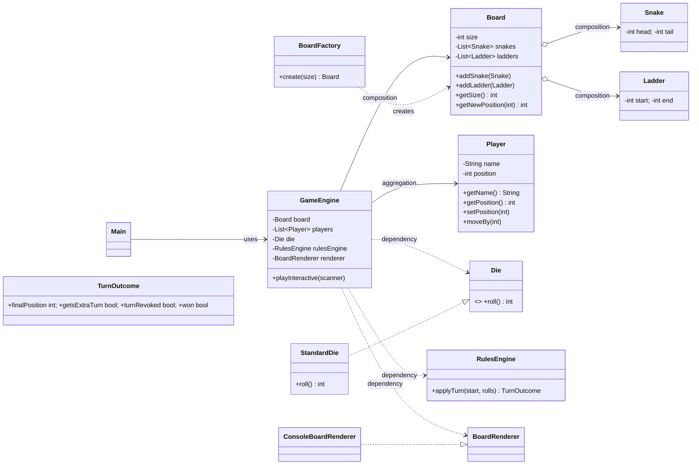

## Snakes and Ladders (Java, SOLID, CLI)

Run a console-based Snakes and Ladders game with:
- Dynamic board size (N x N)
- Variable number of players
- Difficulty levels (easy, medium, hard) that change counts of snakes and ladders
- Rules: extra roll on 6, three 6s in a row revokes the turn, kill rule when landing on another player
- Live board rendering with symbols/emojis: 🐍 for snake heads, ⬆ for ladder starts, colorful tokens for players, and a legend after every move
  - Numbering matches classic boards: bottom-left starts at 1 and increases upward with serpentine rows (see example below)

### How to run

1. Compile (PowerShell, UTF-8 for emoji support):
```
cd "C:\Users\Vinayak Paka\Desktop\LLD_22"
javac -encoding UTF-8 -d out (Get-ChildItem -Recurse -Filter *.java | % FullName)
```
2. Run:
```
java "-Dfile.encoding=UTF-8" -cp out com.game.snakesladder.Main
```

### Inputs (prompted by CLI)
- Board size N (integer, e.g., 7 for a 7x7 board)
- Difficulty: easy | medium | hard
- Number of players (>= 2)
- Player names

### Rules Implemented
- Rolling a 6 grants an immediate extra roll.
- Rolling three 6s in a single turn revokes the entire movement for that turn.
- Landing on the head of a snake or base of a ladder triggers a jump.
- Landing on an occupied cell "kills" the other player, sending them back to start (cell 0).
- Exact finish: moves that overshoot the last cell are ignored for that roll; you must land exactly on the last cell to win.

### Board Rendering
- Before and after every move, the current board is printed in a serpentine layout.
- Symbols:
  - 🐍 marks snake heads; a legend shows head→tail pairs.
  - ⬆ marks ladder starts; a legend shows start→end pairs.
  - Players are shown as colorful tokens (🔴 🔵 ⚪ ⚫ 🔶 🔷 🔸 🔹). Each player also appears in a legend with their name and exact index.
- Cells are widened and centered for readability.
- Numbering: bottom-left is 1; rows alternate left→right then right→left and increase upward, e.g. for a 10×10 board:

| 100 | 99 | 98 | 97 | 96 | 95 | 94 | 93 | 92 | 91 |
| --- | -- | -- | -- | -- | -- | -- | -- | -- | -- |
| 81  | 82 | 83 | 84 | 85 | 86 | 87 | 88 | 89 | 90 |
| 80  | 79 | 78 | 77 | 76 | 75 | 74 | 73 | 72 | 71 |
| 61  | 62 | 63 | 64 | 65 | 66 | 67 | 68 | 69 | 70 |
| 60  | 59 | 58 | 57 | 56 | 55 | 54 | 53 | 52 | 51 |
| 41  | 42 | 43 | 44 | 45 | 46 | 47 | 48 | 49 | 50 |
| 40  | 39 | 38 | 37 | 36 | 35 | 34 | 33 | 32 | 31 |
| 21  | 22 | 23 | 24 | 25 | 26 | 27 | 28 | 29 | 30 |
| 20  | 19 | 18 | 17 | 16 | 15 | 14 | 13 | 12 | 11 |
| 1   | 2  | 3  | 4  | 5  | 6  | 7  | 8  | 9  | 10 |

### Design Overview (SOLID + Patterns)
- Strategy Pattern: `DifficultyStrategy` determines counts and placement constraints for snakes/ladders.
- Factory: `BoardFactory` builds a `Board` using a chosen strategy.
- Single Responsibility: Each class focuses on a single concern (board model, dice, rules, engine, CLI).
- Open/Closed: New difficulty strategies or dice variations can be added without modifying existing classes.
- Liskov, Interface Segregation, Dependency Inversion: Interfaces for dice and difficulty; engine depends on abstractions.

### UML Diagram


## Snake and Ladder (Java) — Low Level Design

This repository contains a mid‑pro level Low Level Design (LLD) and implementation of the classic Snake and Ladder game in Java. It focuses on clean domain modeling, clear separation of concerns, and an easily extensible rules engine.

### Highlights
- **Domain‑driven model**: `Board`, `Jump` (Snake/Ladder), `Player`, `Die`
- **Engine layer**: `GameRules`, `TurnManager`, `GameEngine`
- **Configurable rules**: exact finish, extra turn on six, multiple dice
- **Console app** to run a sample game

---

## How to Run

Prerequisites: Java 17+ (works on Java 11+, but 17 recommended)

Compile (Windows PowerShell):
```bash
javac -d out src/main/java/com/vinayak/snakeladder/model/*.java src/main/java/com/vinayak/snakeladder/engine/*.java src/main/java/com/vinayak/snakeladder/App.java
```

Run:
```bash
java -cp out com.vinayak.snakeladder.App
```

You should see turn‑by‑turn logs and the winner at the end.

---

## Interactive Mode

When you run the app, you'll be prompted for:
- **Board size**: e.g., 100
- **Difficulty**: EASY, MEDIUM, HARD (affects number/placement of snakes and ladders)
- **Number of players**: 2–6, with customizable names
- **Rules**: exact finish and extra turn on max roll
- **Dice**: number of dice (1–3)
- **Mode**: AUTO (random) or MANUAL (press Enter or type a value 1–6)

Manual mode uses a `ManualDie` allowing you to press Enter to roll or type a specific value for testing.

---

## Design Overview

### Class Diagram (conceptual)
```mermaid
classDiagram
  class Board {
    +Board(int size)
    +void addJump(Jump)
    +int size()
    +int applyJumps(int pos)
    +boolean isValidCell(int pos)
    -Map<int, Jump> cellToJump
  }

  class Jump {
    +Jump(int start, int end, JumpType type)
    +int start
    +int end
    +JumpType type
  }

  enum JumpType { SNAKE, LADDER }

  class Die {
    <<interface>>
    +int roll()
    +int faces()
  }

  class StandardDie {
    +StandardDie(int faces)
    +int roll()
    +int faces()
    -Random random
    -int faces
  }

  class Player {
    +Player(String id, String name)
    +String id
    +String name
    +int position
    +void setPosition(int)
  }

  class GameRules {
    +boolean exactFinish
    +boolean extraTurnOnMax
    +int numDice
    +int maxDieFace()
    +int rollDice(List<Die>)
  }

  class TurnManager {
    +TurnManager(List<Player>)
    +Player current()
    +Player next()
    +void grantExtraTurn()
  }

  class GameEngine {
    +GameEngine(Board, GameRules, List<Die>, List<Player>)
    +Player playUntilWin()
    -boolean isWinningMove(Player, int)
  }

  Board --> Jump
  Jump --> JumpType
  GameEngine --> Board
  GameEngine --> GameRules
  GameEngine --> Die
  GameEngine --> Player
  TurnManager --> Player
  StandardDie ..|> Die
```

### Key Design Choices
- **Encapsulation of rules** in `GameRules` keeps the `GameEngine` simple and makes new variants easy (e.g., disable exact finish, two dice, different extra turn policy).
- **`Board.applyJumps`** cleanly centralizes snake/ladder resolution; `GameEngine` just calls it after moving.
- **`TurnManager`** abstracts player rotation and extra turns to avoid ad‑hoc control flow in the engine.
- **`Die` interface** enables swapping implementations (mock/deterministic for tests, weighted dice, etc.).

---

## Code Walkthrough

### Board and Jumps
- `Board` tracks size and a mapping of start cell to a `Jump` (snake or ladder).
- `Jump` validates `start != end` and type semantics (snake goes down, ladder goes up).
- `applyJumps(pos)` will follow at most one jump from that cell; multiple chained jumps on a single cell are prevented by construction.

### Players and Dice
- `Player` stores identity and current position (1‑based). Position `0` means off the board (before starting). You can start from `0` and move forward on first roll.
- `Die` is an interface; `StandardDie` implements a fair die with any number of faces (default 6).

### Rules and Engine
- `GameRules`
  - `exactFinish`: if true, a move that goes beyond the last cell is ignored.
  - `extraTurnOnMax`: if true and the last roll equals the maximum face across all dice, the player gets an extra turn.
  - `numDice`: number of dice to roll each turn.
- `TurnManager` cycles players and can grant an extra turn.
- `GameEngine` executes turns:
  1) Current player rolls dice.
  2) Candidate position is computed; if `exactFinish` prevents overshoot, either stay or move.
  3) Apply snakes/ladders via `Board.applyJumps`.
  4) Check win condition.
  5) Advance to next player unless an extra turn is granted.

---

## Example Configuration (from `App`)
The sample sets up a 100‑cell board with a few snakes and ladders and runs two players.

```java
Board board = new Board(100);
board.addJump(new Jump(2, 38, JumpType.LADDER));
board.addJump(new Jump(16, 6, JumpType.SNAKE));
GameRules rules = new GameRules(true, true, 1);
List<Die> dice = Arrays.asList(new StandardDie(6));
List<Player> players = Arrays.asList(new Player("P1", "Alice"), new Player("P2", "Bob"));
GameEngine engine = new GameEngine(board, rules, dice, players);
Player winner = engine.playUntilWin();
```

---

## Extending the Design
- Add persistence for game state (DTOs + repository interfaces).
- Add event listeners (observer pattern) for UI or logging.
- Add strategy pattern for extra turn policy or win condition.
- Replace console UI with a REST or GUI layer.

---

## Folder Layout
```
src/
  main/java/com/vinayak/snakeladder/
    App.java
    engine/
      GameEngine.java
      GameRules.java
      TurnManager.java
    model/
      Board.java
      Die.java
      Jump.java
      JumpType.java
      Player.java
      StandardDie.java
```

---

## License
MIT


